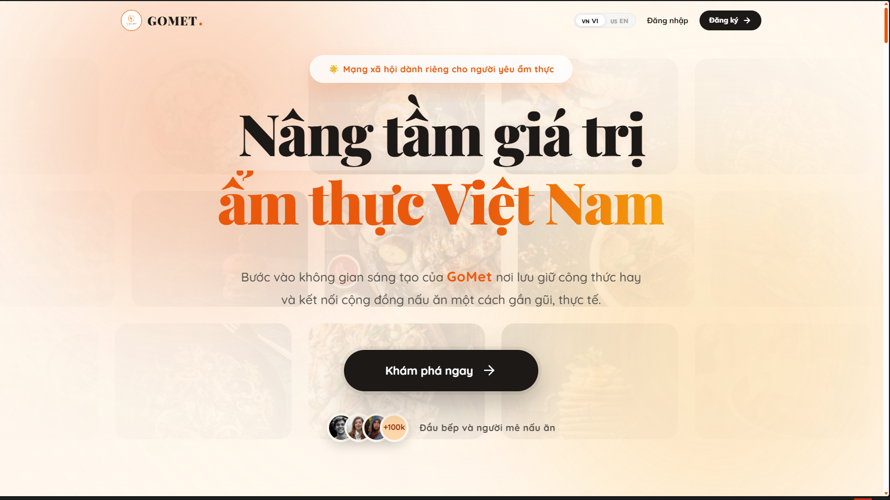
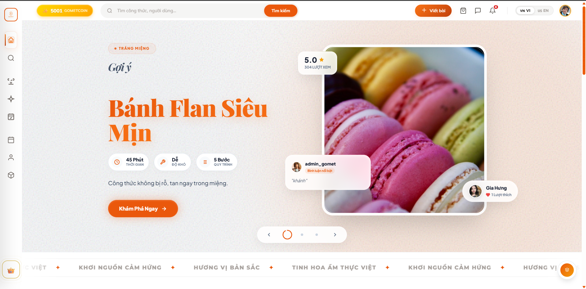
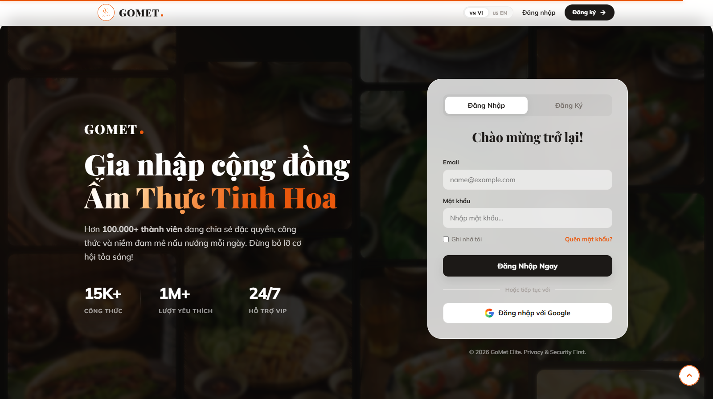
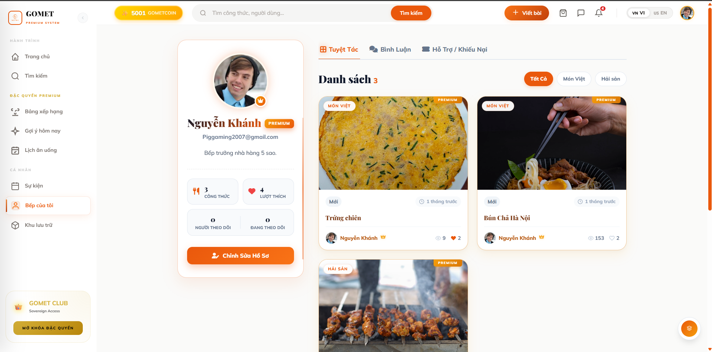
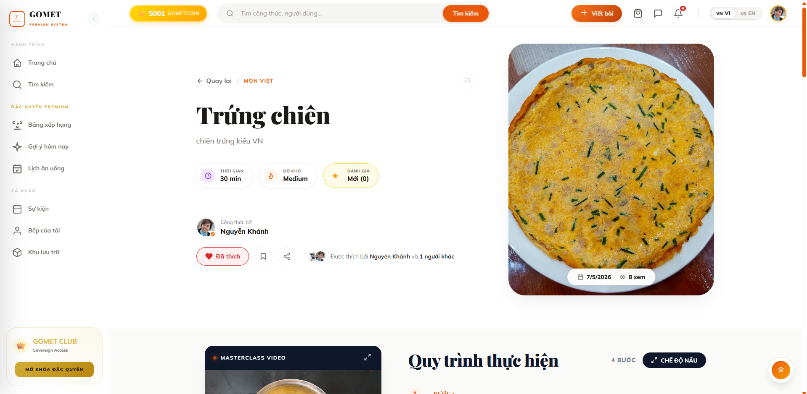
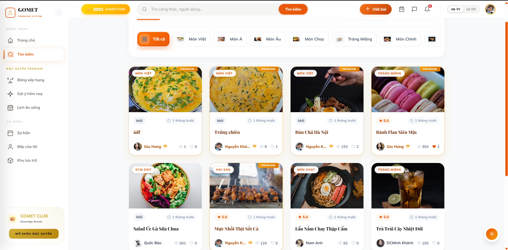

<div align="center">
  <a href="#">
    
  </a>

  <h1 align="center">GoMet - Culinary & Meal Planner Platform</h1>

  <p align="center">
    Nền tảng mạng xã hội ẩm thực thông minh, hỗ trợ chia sẻ công thức, lên kế hoạch bữa ăn và định vị khu chợ dành cho người yêu nấu nướng.
    <br/>
    <br/>
    <a href="#-tính-năng-nổi-bật"><strong>Khám phá tính năng »</strong></a>
    <br/>
    <br/>
    <a href="#">Xem Demo</a>
    ·
    <a href="#">Báo cáo lỗi</a>
    ·
    <a href="#">Yêu cầu tính năng</a>
  </p>
</div>

<div align="center">
  
  
  
  
  
</div>

<hr />

## 📖 Về dự án (About The Project)

**GoMet** là một ứng dụng Web toàn diện được phát triển nhằm mục đích kết nối cộng đồng những người đam mê ẩm thực. Không chỉ dừng lại ở việc chia sẻ công thức nấu ăn, GoMet còn đóng vai trò như một trợ lý ảo giúp người dùng quản lý lịch trình ăn uống khoa học, tìm kiếm nguyên liệu và tương tác với các đầu bếp hàng đầu.

Đây là sản phẩm được xây dựng cho **Đồ án tốt nghiệp**, áp dụng kiến trúc Client-Server hiện đại, tối ưu hóa trải nghiệm người dùng (UX/UI) với các hiệu ứng chuyển động mượt mà và bảo mật dữ liệu chặt chẽ.

---

## ✨ Tính năng nổi bật

* 🗓️ **Gomet Planner Pro:** Hệ thống lên kế hoạch bữa ăn 7 ngày (Sáng, Trưa, Tối) với giao diện Bento Grid, hỗ trợ kéo thả và đánh dấu hoàn thành.
* 🗺️ **Bản đồ đi chợ (Market Map):** Tích hợp GPS và Google Maps, tự động định vị người dùng và thả ghim (pin) các khu chợ, siêu thị thực phẩm gần nhất.
* 🏆 **Bảng xếp hạng (Leaderboard):** Thuật toán tính điểm tự động xếp hạng các món ăn thịnh hành và Đầu bếp (Chefs) xuất sắc nhất theo tuần/tháng.
* 👑 **Hệ thống phân quyền & Giới hạn lượt xem:** 
  * Tài khoản Guest/Free bị giới hạn lượt xem bài viết mỗi ngày.
  * Tài khoản Premium (VIP) trải nghiệm không giới hạn.
  * **Event Mode (Chế độ lễ hội):** Hệ thống Admin có thể kích hoạt giờ vàng đọc miễn phí toàn server thông qua System Config.
* 🎨 **Giao diện Cinematic & Animation:** Giao diện Dark Mode sang trọng (Kính mờ - Glassmorphism) kết hợp cùng thư viện hoạt ảnh GSAP mang lại trải nghiệm 60FPS mượt mà.

---

## 📸 Ảnh chụp màn hình (Screenshots)

Dưới đây là một số hình ảnh thực tế từ ứng dụng GoMet:

| Trang Giới Thiệu (Landing Page) | Trang Chủ (Home) |
| :---: | :---: |
|  |  |
| **Đăng Nhập / Đăng Ký** | **Trang Cá Nhân (Profile)** |
|  |  |
| **Chi Tiết Công Thức (Post Detail)** | **Tìm Kiếm (Search Page)** |
|  |  |

---

## 🛠️ Công nghệ sử dụng (Tech Stack)

### 🖥️ Frontend (Client-side)
* **Framework:** Vue.js 3 (Composition API) + Vite
* **State Management:** Pinia
* **Routing:** Vue Router
* **Styling:** SCSS, CSS Modules, CSS Variables
* **Animation:** GSAP (GreenSock)
* **HTTP Client:** Axios

### ⚙️ Backend (Server-side)
* **Framework:** Spring Boot 3, Spring MVC
* **Language:** Java 17+
* **Security:** Spring Security, JWT (JSON Web Tokens)
* **ORM / Database:** Spring Data JPA, Hibernate, MySQL
* **Utilities:** Lombok, SLF4J

---

## 📂 Cấu trúc thư mục tiêu biểu (Folder Structure)

```text
📦 GoMet-Project
 ┣ 📂 GoMet-BE (Backend - Spring Boot)
 ┃ ┣ 📂 src/main/java/poly/edu
 ┃ ┃ ┣ 📂 controller    # Cung cấp các API Endpoints
 ┃ ┃ ┣ 📂 service       # Xử lý logic nghiệp vụ
 ┃ ┃ ┣ 📂 dao           # Tương tác với CSDL (JPA Repositories)
 ┃ ┃ ┣ 📂 entity        # Lớp thực thể (Models)
 ┃ ┃ ┗ 📂 dto           # Đối tượng truyền dữ liệu
 ┃ ┗ 📜 pom.xml         # Cấu hình Maven
 ┃
 ┗ 📂 DATN-CD (Frontend - Vue.js)
   ┣ 📂 src
   ┃ ┣ 📂 assets        # Hình ảnh, file SCSS toàn cục
   ┃ ┣ 📂 components    # Các component tái sử dụng (MapModal, Leaderboard...)
   ┃ ┣ 📂 composables   # Logic dùng chung (usePostViewLimit, useToast...)
   ┃ ┣ 📂 services      # Cấu hình gọi API (Axios)
   ┃ ┣ 📂 stores        # Quản lý trạng thái bằng Pinia
   ┃ ┗ 📂 pages         # Các trang chính của ứng dụng
   ┣ 📂 imgdemo         # Thư mục chứa ảnh minh họa cho dự án
   ┗ 📜 package.json    # Cấu hình NPM